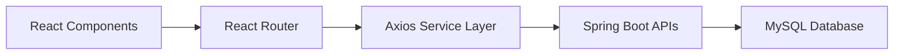

# 🎨 Employee Payroll Management System - Frontend

<<<<<<< HEAD
<div align="center">


*A modern and responsive user interface for the Employee Payroll Management System*

</div>

---

# 📋 Table of Contents

* Features
* Architecture
* Tech Stack
* Screenshots
* Installation
* Project Structure
* Authentication
* Deployment
* Performance
* Future Enhancements
=======
## 📌 Overview

The Frontend of the Employee Payroll Management System is developed using React.js and Vite. It provides a modern and responsive user interface for employees and administrators to manage payroll, leave requests, departments, job roles, and employee information.

---

## 🚀 Live Application

Frontend URL:

https://employee-payroll-management-system-ashy.vercel.app
>>>>>>> e1c4208 (Improve Mobile Responsiveness)

---

# 📖 Overview

<<<<<<< HEAD
The Employee Payroll Management System Frontend is a React-based web application that provides an intuitive and responsive interface for managing employees, payroll, departments, job roles, and leave requests.

The frontend communicates with a Spring Boot backend using REST APIs secured through JWT Authentication.

---

# ✨ Features

## 🔐 Authentication & Authorization

* Secure Login
* Employee Self Registration
* JWT Token Authentication
* Logout Functionality
* Protected Routes
* Role-Based Access Control

---

## 👨‍💼 Employee Management

* View Employee Details
* Add Employee
* Update Employee Information
* Delete Employee
* Search Employees
* Employee Profile Management

---

## 🏢 Department Management

* Create Departments
* Edit Departments
* Delete Departments
* View Department Information

---

## 💼 Job Role Management

* Create Job Roles
* Update Salary Structures
* Assign Job Roles
* Manage Salary Details

---

## 📅 Leave Management

* Apply Leave Requests
* Track Leave Status
* View Leave History
* Leave Approval Workflow
* Leave Rejection Workflow

Supported Leave Types:

* Sick Leave
* Casual Leave
* Paid Leave
* Unpaid Leave

---

## 💰 Payroll Management

* View Payroll Information
* Payroll Summary
* Salary Details
* Employee Payroll History
* Payroll Status Tracking

---

## 📊 Dashboard Analytics

### Admin Dashboard

* Total Employees
* Total Departments
* Total Job Roles
* Pending Leave Requests
* Payroll Statistics

### Employee Dashboard

* Personal Information
* Payroll Summary
* Leave Summary
* Profile Information

---

## 📱 Modern UI/UX

* Responsive Design
* Mobile-Friendly Interface
* Bootstrap 5 Components
* Fast Navigation
* Dynamic Dashboard
* Modern User Experience

---

# 🏗️ Frontend Architecture



---

# 🛠️ Tech Stack

## Frontend Technologies

* React.js 19
* React Router DOM
* Axios
* Bootstrap 5
* Vite
* JavaScript ES6+
* HTML5
* CSS3

---

# 📂 Project Structure

```text
src/
│
├── components/
│   ├── auth/
│   ├── dashboard/
│   ├── employees/
│   ├── departments/
│   ├── jobs/
│   ├── leaves/
│   ├── payroll/
│   └── common/
│
├── services/
│   ├── api.js
│   └── authService.js
│
├── context/
├── hooks/
├── utils/
│
├── App.jsx
├── main.jsx
└── index.css
```

---

# 🔄 Application Workflow

1. User opens the application.
2. User logs in or registers.
3. React frontend sends API requests using Axios.
4. Backend validates credentials.
5. JWT token is generated.
6. Token is stored in Local Storage.
7. Protected routes become accessible.
8. User accesses dashboard and management modules.

---

# 🔐 Authentication

The application uses JWT Authentication.

### User Flow

1. Login with credentials.
2. Backend validates user.
3. JWT token returned.
4. Token stored in Local Storage.
5. Authorization header attached to every request.
6. Protected routes verified before access.

---

# ⚙️ Installation

## Clone Repository

```bash
git clone <frontend-repository-url>
```

## Navigate To Project

```bash
cd Employee-Payroll-Management-System-Frontend
```

## Install Dependencies

```bash
=======
### Authentication

* User Login
* Employee Registration
* JWT Token Handling
* Logout Functionality
* Role Based Navigation

### Employee Features

* Dashboard
* Profile Management
* Leave Application
* Leave History
* Payroll Details

### Admin Features

* Employee Management
* Department Management
* Job Role Management
* Leave Approval/Rejection
* Payroll Processing
* Dashboard Analytics

### UI Features

* Responsive Design
* Bootstrap 5 Styling
* Protected Routes
* Dynamic Dashboard
* Modern User Experience

---

## 🛠️ Technology Stack

* React 19
* React Router DOM
* Axios
* Bootstrap 5
* Vite
* JavaScript
* HTML5
* CSS3

---

## 📂 Project Structure

src/

├── components/

├── context/

├── hooks/

├── services/

├── utils/

├── App.jsx

├── main.jsx

└── index.css

---

## ⚙️ Installation

### Clone Repository

git clone <frontend-repository-url>

### Install Dependencies

>>>>>>> e1c4208 (Improve Mobile Responsiveness)
npm install

<<<<<<< HEAD
## Configure Backend URL

Update:

```javascript
src/services/api.js
```

```javascript
const API_BASE_URL =
'https://employee-management-system-backend-99hu.onrender.com/api/v1';
```

## Run Development Server

```bash
=======
### Configure Backend URL

src/services/api.js

const API_BASE_URL =
'https://employee-management-system-backend-99hu.onrender.com/api/v1'

### Start Application

>>>>>>> e1c4208 (Improve Mobile Responsiveness)
npm run dev

---

## 🌐 Deployment

Platform: Vercel

Production URL:

https://employee-payroll-management-system-ashy.vercel.app

Application runs on:

<<<<<<< HEAD
```text
http://localhost:5173
```

---

# 🚀 Build For Production

```bash
npm run build
```

Preview Build:

```bash
npm run preview
```

---

# 📱 Screenshots

### Login Page

Add Screenshot Here

### Registration Page

Add Screenshot Here

### Admin Dashboard

Add Screenshot Here

### Employee Dashboard

Add Screenshot Here

### Employee Management

Add Screenshot Here

### Leave Management

Add Screenshot Here

### Payroll Management

Add Screenshot Here

---

# 🌐 Deployment

## Frontend Deployment

Platform: Vercel

Production URL:

https://employee-payroll-management-system-ashy.vercel.app

---

# 📈 Performance Metrics

* Fast Vite Build System
* Optimized API Requests
* Responsive UI Design
* Smooth Navigation Experience
* Reusable React Components
=======
## 🔐 Authentication

The frontend communicates with the backend using JWT Authentication.

Token is stored in Local Storage after successful login.

Authorization Header:

Bearer <JWT_TOKEN>

---

## 📱 Screens

* Login Page
* Registration Page
* Admin Dashboard
* Employee Dashboard
* Employee Management
* Department Management
* Job Role Management
* Leave Management
* Payroll Management
>>>>>>> e1c4208 (Improve Mobile Responsiveness)

---

# 🧪 Testing

<<<<<<< HEAD
Frontend Testing Includes:

* UI Testing
* Form Validation Testing
* Authentication Testing
* Route Protection Testing
* API Integration Testing

---

# 🚀 Future Enhancements

* Attendance Management
* PDF Payslip Download
* Email Notifications
* Dark Mode Support
* Mobile Application
* Advanced Reporting Dashboard
* Employee Performance Tracking

---

# 📄 License

This project is developed for educational and learning purposes.

---

⭐ If you found this project useful, consider giving it a star on GitHub.
=======

>>>>>>> e1c4208 (Improve Mobile Responsiveness)
